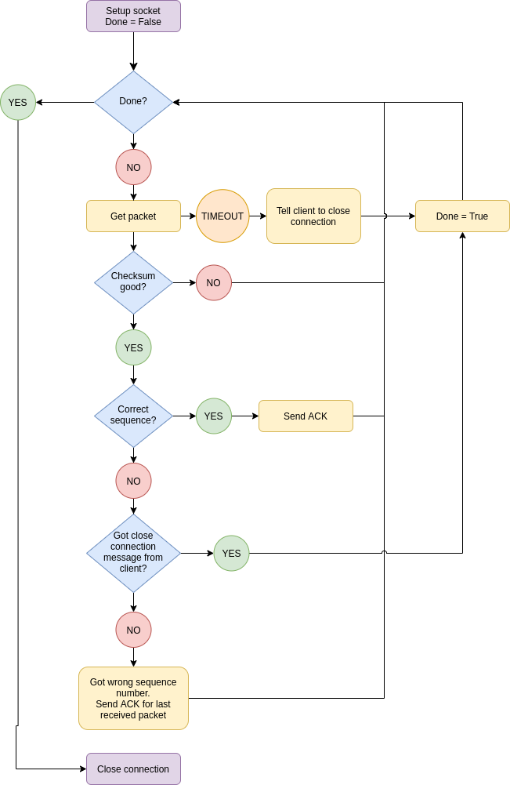
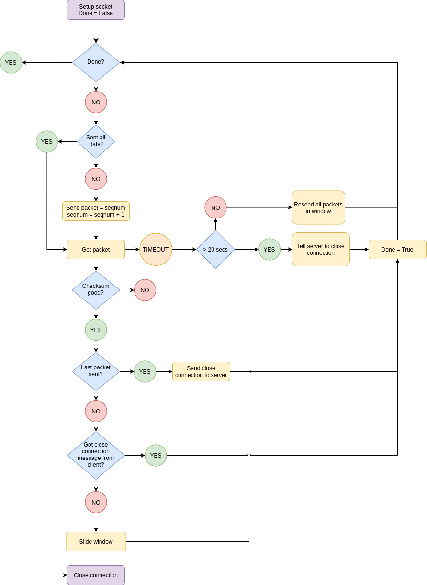

# Go-Back-N-Protocol

In this project, the objective is to implement the Go-Back-N data transmission protocol using Python. The Go-Back-N protocol uses timeouts and acknowledgements to provide reliable data transfer over unreliable services, such as UDP.  

## Server

The following figure describes the high-level functionality of the server-side implementation of the GBN protocol.

## Client

The following figure describes the high-level functionality of the client-side implementation of the GBN protocol.

